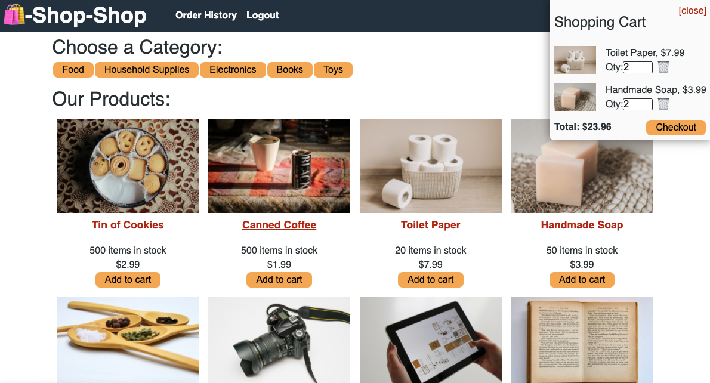

# Shop-Shop
E-commerce Shop

## Table of contents
* [General info](#general-info)
* [Deployed Link](#deployed_link)
* [Screenshots](#screenshots)
* [Setup](#setup)
* [Code](#code)
* [Licenses](#licenses)
* [Inspiration](#inspiration)
* [Contact](#contact)

## General info
Shop-Shop is an ecommerce app using a redux store.

## Deployed Link
[Shop-Shop](https://shop-shop-app.herokuapp.com/)

## Screenshots

## Setup
* Clone GitHub repository 
* run npm installl in root directiory, server directory, and client directory.

## Code and Technologies
* Node.js
* MongoDB
* Apollo
* Redux
* React

## Licenses
* MIT license
* ISC

## Inspiration
The code was refactored use redux.

## Contact
* Jack H

